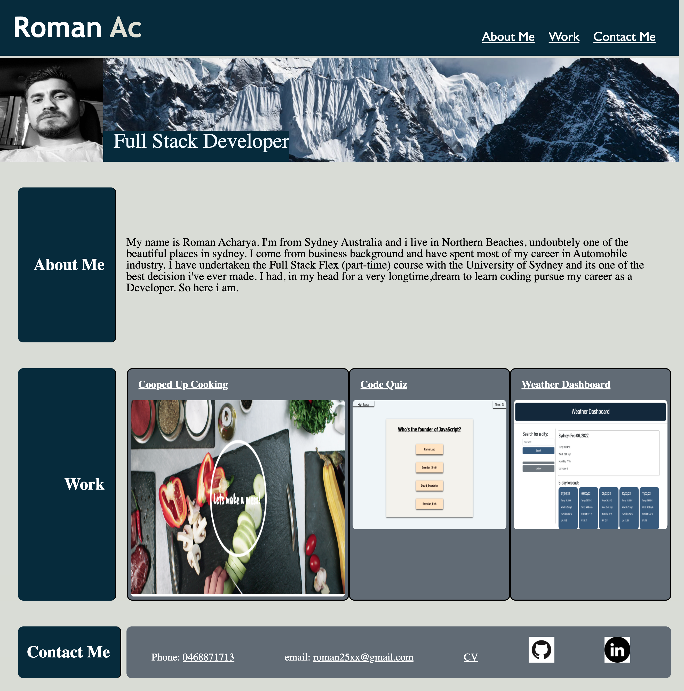

# <Week 2 Assignment>

# <Project Portfolio>

## Project Portflio is an opportunity to present myself and showcase the inputs i have been putting to build my career as a full stack developer. As a very new student with no previous coding experience i have given my 100% to this project. 

# Mission
    * to create a portfolio website to introduce oneself to the potential employer so that they can review samples of work done and assess.

# Synopsis of work done
    
    * clean and organised "html" contents
    * clean and symantic css file
    * reset.css file attached
    * tried to incorporate optimum learened styles
    * deploy flex attributes 
    * deploy display attributes
    * deploy media responses 

# Link to  the deployed page

    https://roman-ac.github.io/assignment2-project-portfolio/

# Screenshot

